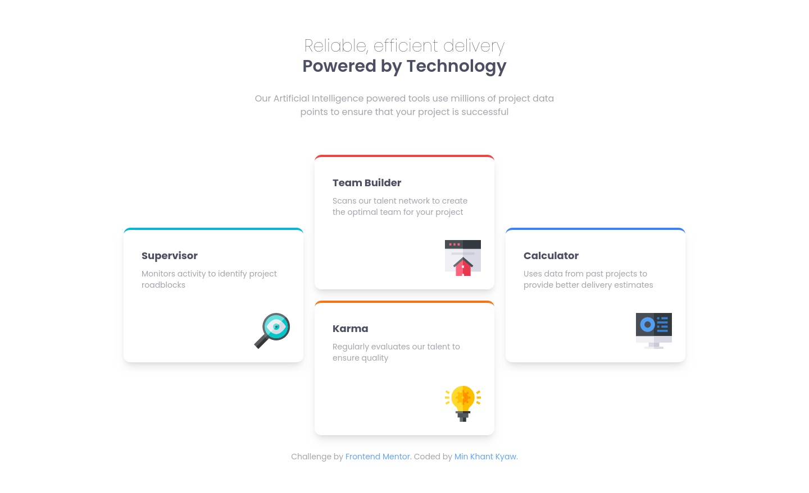
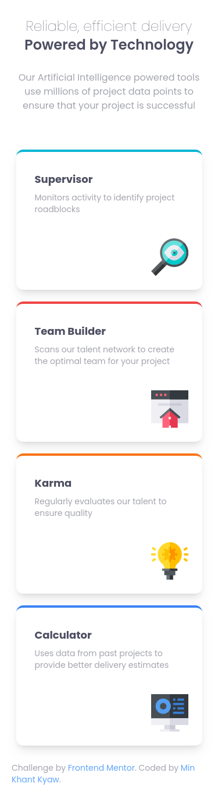

# Frontend Mentor - Four card feature section solution

This is a solution to the [Four card feature section challenge on Frontend Mentor](https://www.frontendmentor.io/challenges/four-card-feature-section-weK1eFYK). Frontend Mentor challenges help you improve your coding skills by building realistic projects. 

## Table of contents

- [Overview](#overview)
  - [The challenge](#the-challenge)
  - [Screenshot](#screenshot)
  - [Links](#links)
- [My process](#my-process)
  - [Built with](#built-with)
  - [What I learned](#what-i-learned)
- [Author](#author)

## Overview

### The challenge

Users should be able to:

- View the optimal layout for the site depending on their device's screen size

### Screenshot

### Links

- Solution URL: [Github Repo](https://github.com/mkhantk/four-card-feature-section)
- Live Site URL: [Frontend Mentor | Four card feature section](https://mkhantk.github.io/four-card-feature-section/)

## My process

### Built with

- Semantic HTML5 markup
- CSS custom properties
- Flexbox
- Mobile-first workflow
- [React](https://reactjs.org/) - JS library
- Vite
- Tailwindcss

### What I learned

This time, I tried this with reactjs and tailwindcss and see how it works. It looks alright... just a couple tweaks here and there. I learned abit about the vite + react flow. 

## Author

- Frontend Mentor - [@mkhantk](https://www.frontendmentor.io/profile/mkhantk)

